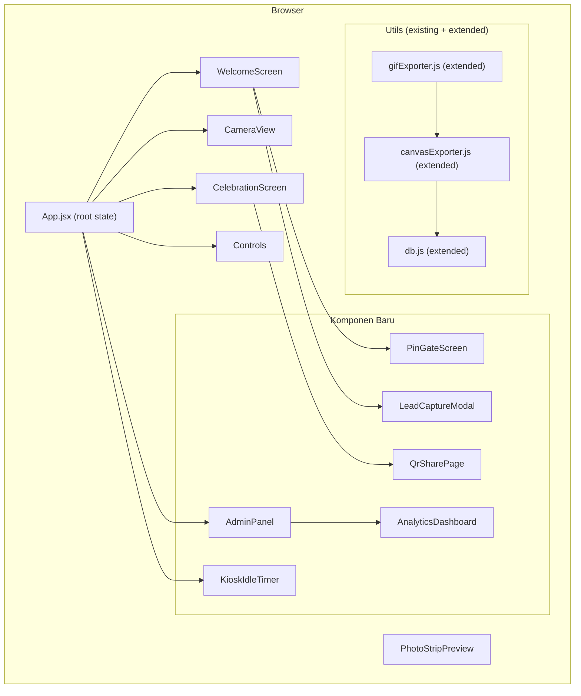
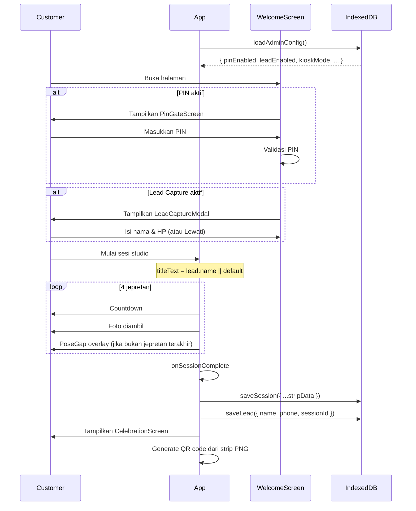

# Design Document — Photobooth Enhancement

## Overview

Dokumen ini mendeskripsikan desain teknis untuk **Photobooth Enhancement** — penambahan 14 fitur baru pada aplikasi **Life 4 Cuts**, sebuah photobooth web app berbasis React + Vite yang sudah berjalan di Vercel.

Filosofi desain: **tambahan inkremental, bukan rewrite**. Setiap fitur baru diintegrasikan ke dalam struktur komponen dan utilitas yang sudah ada. IndexedDB (via `db.js`) tetap menjadi satu-satunya sumber kebenaran untuk semua data persisten. Tidak ada backend baru yang ditambahkan.

### Fase Pengembangan

| Fase | Fitur | Prioritas |
|------|-------|-----------|
| 1 — Core Experience | Mobile Responsive, Pose Gap, Watermark | Tinggi |
| 2 — Event Ready | Lead Capture, PIN Event, QR Delivery, Kiosk Mode | Tinggi |
| 3 — Owner Tools | Analytics, Admin Panel, Backup & Export | Sedang |
| 4 — Polish | Musik Kustom (extend), Multi-line Caption, Retake dari Celebration, Notifikasi | Sedang |

---

## Architecture

### Arsitektur Keseluruhan (Existing + New)



### Keputusan Arsitektur Kunci

1. **State Management**: Tetap menggunakan React `useState` di `App.jsx` sebagai state global. Tidak ada Redux atau Context API baru yang diperlukan — scope fitur baru terbatas dan tidak memerlukan prop drilling yang dalam.

2. **IndexedDB Schema Extension**: `db.js` akan ditambah store baru (`leads`, `adminConfig`) dan schema diupgrade ke `DB_VERSION = 2`. Store lama tidak diubah.

3. **Admin Panel Route**: Menggunakan state `screen` di `App.jsx` (pattern yang sudah ada) untuk routing. AdminPanel dapat diakses via URL hash `#admin` atau tap logo 5 kali. Tidak menggunakan React Router untuk menghindari dependency baru.

4. **QR Share Page**: Dibuat sebagai route terpisah `/share` yang merender komponen `QrSharePage.jsx`. Data foto dikirim via URL parameter base64 atau localStorage sementara.

5. **JSZip untuk Backup**: Satu-satunya dependency baru yang perlu diinstall adalah `jszip`. Semua library lain sudah tersedia.

---

## Components and Interfaces

### Komponen Baru

#### `PinGateScreen.jsx`
```
Props:
  onSuccess: () => void
  onAdminAccess?: () => void  // tap logo untuk ke admin

State internal:
  pinInput: string
  error: string | null
```

#### `LeadCaptureModal.jsx`
```
Props:
  onSubmit: (lead: LeadData) => void
  onSkip: () => void

Type LeadData:
  name: string
  phone: string
```

#### `AdminPanel.jsx`
```
Props:
  onClose: () => void

State internal:
  isAuthenticated: boolean  (juga di sessionStorage)
  activeTab: 'config' | 'analytics' | 'leads' | 'backup'

Sub-komponen:
  - AnalyticsDashboard
  - LeadTable
  - BackupTools
  - FeatureToggles
```

#### `AnalyticsDashboard.jsx`
```
Props: (none — baca langsung dari IndexedDB)

Data yang dihitung:
  - totalSessions: { today, last7, last30 }
  - topTheme: string
  - topFilter: string
  - hourlyDistribution: number[24]
  - weeklyDistribution: number[7]
```

#### `QrSharePage.jsx`
```
Route: /share?data={base64}

Props: (none — ambil data dari URLSearchParams)
State:
  stripDataUrl: string | null
  error: string | null
```

#### `KioskIdleTimer.jsx`
```
Props:
  idleMinutes: 1 | 3 | 5
  enabled: boolean
  onIdle: () => void

Menggunakan: mousemove, keydown, touchstart event listeners
```

### Komponen yang Diextend

#### `CelebrationScreen.jsx` (extended)
Tambahan props:
```
onRetakePhoto: (index: number) => void
showNotificationToggle?: boolean
```

Tambahan UI:
- Tombol "Ulang" per thumbnail foto
- Reminder inline "Jangan lupa simpan"
- Toggle notifikasi browser
- QR code delivery (generate dari strip data, bukan URL saja)

#### `CameraView.jsx` (extended)
Tambahan props:
```
poseGapSeconds: 2 | 3 | 5
```

Perubahan internal `startStudioSession`:
```
// Setelah setiap shot (kecuali terakhir):
setCountdown(null);
setIsPoseGap(true);  // tampilkan overlay "Siap pose!"
await new Promise(res => setTimeout(res, poseGapSeconds * 1000));
setIsPoseGap(false);
// mulai countdown berikutnya
```

#### `Controls.jsx` (extended)
Tambahan sections:
- Pose Gap selector (2s / 3s / 5s)
- Watermark text + opacity slider
- Multi-line Caption textarea + presets + character counter
- Upload Musik Kustom (dipindahkan dari MusicPlayer)

#### `WelcomeScreen.jsx` (extended)
Perubahan:
- Check PIN Event sebelum render konten utama
- Render `PinGateScreen` jika PIN aktif
- Render `LeadCaptureModal` setelah PIN (jika LeadCapture aktif)

### Modifikasi `canvasExporter.js`

Tambahan parameter di fungsi `drawPhotoStripToCanvas`:
```javascript
// Parameter baru di options:
watermarkText: string | null      // teks watermark
watermarkOpacity: number          // 0.0 - 1.0
captionText: string               // multi-line caption
captionLineHeight: number         // spasi antar baris
```

Watermark dirender di langkah baru setelah footer:
```javascript
// Step 14: Watermark
if (watermarkText && watermarkOpacity > 0) {
  ctx.save();
  ctx.globalAlpha = watermarkOpacity;
  ctx.font = '500 12px "Plus Jakarta Sans", sans-serif';
  ctx.fillStyle = cfg.textColor;
  ctx.textAlign = 'right';
  ctx.textBaseline = 'bottom';
  ctx.fillText(watermarkText, stripWidth - 10, totalHeight - 8);
  ctx.restore();
}
```

Multi-line caption menggunakan `measureText` + word-wrap manual:
```javascript
function wrapText(ctx, text, maxWidth) {
  const words = text.split(' ');
  const lines = [];
  let currentLine = '';
  for (const word of words) {
    const test = currentLine ? `${currentLine} ${word}` : word;
    if (ctx.measureText(test).width > maxWidth && currentLine) {
      lines.push(currentLine);
      currentLine = word;
    } else {
      currentLine = test;
    }
  }
  if (currentLine) lines.push(currentLine);
  return lines;
}
```

---

## Data Models

### IndexedDB Schema v2

```javascript
const DB_VERSION = 2;

const STORES = {
  sessions:    'photoSessions',   // existing
  playlist:    'musicPlaylist',   // existing
  settings:    'userSettings',    // existing (extended)
  leads:       'leadCaptures',    // NEW
  adminConfig: 'adminConfig',     // NEW
};
```

#### Store: `leadCaptures`
```typescript
interface LeadCapture {
  id: string;          // "lead_${Date.now()}_${random}"
  sessionId: string;   // FK ke photoSessions.id
  name: string;
  phone: string;
  date: string;        // ISO 8601
  dateFormatted: string;
}
```

#### Store: `adminConfig`
```typescript
interface AdminConfig {
  key: string;         // keyPath = 'default'
  
  // Auth
  passwordHash: string; // SHA-256 hex hash dari password
  
  // Feature Flags
  leadCaptureEnabled: boolean;
  pinEventEnabled: boolean;
  pinEventValue: string;       // 4-6 digit
  kioskModeEnabled: boolean;
  kioskIdleMinutes: 1 | 3 | 5;
  watermarkEnabled: boolean;
  qrDeliveryEnabled: boolean;
  
  // Defaults
  defaultTheme: string;
  defaultFilter: string;
  
  updatedAt: string;
}
```

#### Store: `userSettings` (extended)
Tambahan field baru yang disimpan bersama settings yang ada:
```typescript
// Field baru di existing userSettings record:
poseGapSeconds: 2 | 3 | 5;
watermarkText: string;
watermarkOpacity: number;      // 0.0 - 1.0
captionText: string;
musicVolume: number;           // existing, tetap
```

#### Store: `photoSessions` (extended)
Tidak ada perubahan schema — field `titleText` sudah ada untuk menyimpan nama Customer dari Lead Capture.

### Data Flow: Sesi Lengkap dengan Fitur Baru



---

## Correctness Properties

*A property is a characteristic or behavior that should hold true across all valid executions of a system — essentially, a formal statement about what the system should do. Properties serve as the bridge between human-readable specifications and machine-verifiable correctness guarantees.*

Fitur ini melibatkan logika bisnis yang dapat diuji secara properti: persistensi data (round-trip), validasi input, komputasi statistik, transformasi teks, dan state machine. Library yang digunakan adalah **Vitest** + **fast-check** (untuk TypeScript/JavaScript).

Setiap property test dikonfigurasi dengan minimum 100 iterasi.

---

### Property 1: Persistensi PoseGap — Round Trip

*For any* nilai PoseGap yang valid (2, 3, atau 5 detik), menyimpan nilai tersebut ke IndexedDB dan kemudian memuatnya kembali harus menghasilkan nilai yang persis sama.

**Validates: Requirements 2.5**

---

### Property 2: Overlay PoseGap Ditampilkan Selama Durasi yang Dikonfigurasi

*For any* konfigurasi PoseGap yang valid, setelah sebuah jepretan selesai dan masih ada jepretan berikutnya, overlay "Siap pose berikutnya!" harus ditampilkan selama tepat durasi PoseGap tersebut (dalam toleransi ±100ms) sebelum countdown berikutnya dimulai.

**Validates: Requirements 2.2, 2.4**

---

### Property 3: Watermark Muncul di Pojok Kanan Bawah Strip

*For any* teks watermark non-kosong dan opacity > 0, ekspor PNG PhotoStrip harus mengandung teks watermark tersebut yang dirender di area pojok kanan bawah canvas.

**Validates: Requirements 3.2**

---

### Property 4: Persistensi Konfigurasi Watermark — Round Trip

*For any* kombinasi teks watermark dan nilai opacity (0.0–1.0), menyimpan ke IndexedDB dan memuatnya kembali harus mengembalikan teks dan opacity yang identik.

**Validates: Requirements 3.5**

---

### Property 5: Nama Customer Muncul di Judul PhotoStrip

*For any* string nama Customer yang valid (non-kosong, non-whitespace), mengirimkan data lead dengan nama tersebut harus menghasilkan `titleText` pada PhotoStrip yang mengandung nama Customer tersebut.

**Validates: Requirements 4.3**

---

### Property 6: Persistensi Data Lead — Round Trip

*For any* data lead (nama, nomor HP, sessionId), menyimpan ke IndexedDB dan memuat semua lead kembali harus menghasilkan record yang mengandung semua field tersebut dengan nilai yang identik.

**Validates: Requirements 4.4**

---

### Property 7: Kolom CSV Lead Selalu Lengkap

*For any* kumpulan data lead yang tersimpan, file CSV yang di-generate harus memiliki header dan setiap baris data yang mengandung semua kolom yang diwajibkan: `nama`, `nomor_hp`, `tanggal`, `jam`, `id_sesi`.

**Validates: Requirements 4.7, 10.3**

---

### Property 8: PIN Gate Selalu Aktif Saat Dikonfigurasi

*For any* konfigurasi PIN Event yang aktif, membuka WelcomeScreen tanpa memasukkan PIN yang benar terlebih dahulu harus selalu menampilkan form input PIN — tidak pernah konten WelcomeScreen utama.

**Validates: Requirements 5.3, 5.7**

---

### Property 9: PIN Benar Membuka Akses, PIN Salah Menolak

*For any* PIN yang dikonfigurasi (4–6 digit), memasukkan nilai yang identik dengan PIN tersebut harus memberikan akses ke WelcomeScreen, sedangkan setiap nilai lain (berbeda satu karakter pun) harus menampilkan pesan error dan mengosongkan field.

**Validates: Requirements 5.4, 5.5**

---

### Property 10: Persistensi Status dan Nilai PIN — Round Trip

*For any* nilai PIN dan status aktif/nonaktif, menyimpan ke IndexedDB dan memuatnya kembali harus mengembalikan status dan nilai PIN yang identik.

**Validates: Requirements 5.6**

---

### Property 11: QR Code Memiliki Ukuran Minimal yang Diperlukan

*For any* data PhotoStrip yang di-generate dari sesi yang selesai, QR code yang dirender di CelebrationScreen harus memiliki dimensi minimal 120×120 piksel.

**Validates: Requirements 6.4**

---

### Property 12: Advanced Controls Tersembunyi Saat Kiosk Mode Aktif

*For any* konfigurasi KioskMode yang diaktifkan, panel Controls harus tidak menampilkan kontrol tingkat lanjut (AI Background, doodle tools, AR props, custom frame upload) — hanya filter dan frame preset yang ditampilkan.

**Validates: Requirements 7.3**

---

### Property 13: Idle Timer Reset ke WelcomeScreen

*For any* durasi idle yang dikonfigurasi (1, 3, atau 5 menit) saat KioskMode aktif, setelah tidak ada interaksi pengguna selama durasi tersebut, aplikasi harus mereset tampilan ke WelcomeScreen.

**Validates: Requirements 7.4**

---

### Property 14: Persistensi Konfigurasi KioskMode — Round Trip

*For any* konfigurasi KioskMode (status aktif, durasi idle), menyimpan ke IndexedDB dan memuatnya kembali harus mengembalikan konfigurasi yang identik.

**Validates: Requirements 7.7**

---

### Property 15: Komputasi Statistik Sesi per Periode Selalu Akurat

*For any* kumpulan data sesi dengan timestamp yang diketahui, jumlah sesi yang dihitung untuk periode hari ini, 7 hari terakhir, dan 30 hari terakhir harus tepat sesuai jumlah sesi yang sesungguhnya jatuh pada masing-masing periode tersebut.

**Validates: Requirements 8.1**

---

### Property 16: Komputasi Mode (Theme dan Filter Terpopuler) Selalu Benar

*For any* kumpulan data sesi, theme dan filter yang dilaporkan sebagai "paling sering digunakan" harus merupakan nilai dengan frekuensi kemunculan tertinggi dalam dataset tersebut.

**Validates: Requirements 8.2, 8.3**

---

### Property 17: Distribusi Hourly dan Weekly Mencakup Semua Sesi

*For any* kumpulan data sesi, jumlah total dari distribusi per jam (0–23) dan jumlah total dari distribusi per hari dalam seminggu harus masing-masing sama dengan total jumlah sesi, dan setiap sesi harus muncul di bucket yang tepat sesuai timestamp-nya.

**Validates: Requirements 8.4, 8.5**

---

### Property 18: Admin Panel Selalu Meminta Password Saat Tidak Terotentikasi

*For any* state aplikasi tanpa autentikasi yang valid di sessionStorage, mengakses AdminPanel harus selalu menampilkan form password terlebih dahulu — tidak pernah langsung menampilkan konten admin.

**Validates: Requirements 9.2**

---

### Property 19: Feature Toggle Mempengaruhi Perilaku Fitur

*For any* feature flag (leadCapture, pinEvent, kioskMode, watermark, qrDelivery), mengubah nilai toggle di AdminPanel dan menyimpannya harus mengubah perilaku fitur yang bersangkutan pada sesi berikutnya sesuai nilai toggle.

**Validates: Requirements 9.7**

---

### Property 20: Nama File ZIP Mengikuti Format yang Ditentukan

*For any* kumpulan data sesi, setiap file PNG yang dihasilkan di dalam ZIP harus mengikuti format penamaan `life4cuts-{id_sesi}-{tanggal}.png` di mana `{id_sesi}` dan `{tanggal}` sesuai dengan metadata sesi yang bersangkutan.

**Validates: Requirements 10.2**

---

### Property 21: Backup JSON — Export lalu Import Memulihkan State Identik

*For any* state aplikasi yang mengandung data sesi dan pengaturan, mengekspor sebagai JSON backup dan kemudian mengimport file tersebut harus memulihkan semua sesi (metadata) dan pengaturan dengan nilai yang identik.

**Validates: Requirements 10.5**

---

### Property 22: Validasi File Musik — File Invalid Selalu Ditolak

*For any* file yang bukan format MP3/audio yang valid atau berukuran lebih dari 10MB, proses upload harus menolak file tersebut dan menampilkan pesan error yang sesuai, tanpa menyimpan data apapun ke IndexedDB.

**Validates: Requirements 11.6**

---

### Property 23: Word-Wrap Caption Tidak Memotong Teks

*For any* teks caption yang panjangnya melebihi lebar area caption di PhotoStrip, fungsi rendering canvas harus membagi teks menjadi beberapa baris menggunakan word-wrap tanpa memotong karakter apapun — semua teks harus tetap ada di output.

**Validates: Requirements 12.2, 12.6**

---

### Property 24: Penghitung Karakter Caption Selalu Akurat

*For any* string teks caption, penghitung karakter yang ditampilkan di Controls harus selalu menunjukkan nilai yang sama persis dengan `text.length` dari string tersebut, tidak pernah melebihi 200.

**Validates: Requirements 12.5**

---

### Property 25: Retake Foto ke-N Hanya Mengubah Foto ke-N

*For any* index foto N (0, 1, 2, atau 3) dalam sebuah sesi yang selesai, melakukan retake pada foto ke-N harus mengupdate `photos[N]` dengan foto baru, sedangkan semua foto lainnya (`photos[i]` untuk `i ≠ N`) harus tetap tidak berubah.

**Validates: Requirements 13.2, 13.3**

---

## Error Handling

### Strategi Error Handling per Fitur

#### IndexedDB Operations
Semua operasi DB dikemas dalam try/catch. Kegagalan DB tidak boleh crash aplikasi:
```javascript
// Pattern yang digunakan di semua operasi DB baru:
try {
  const db = await openDB();
  await txPut(db, STORES.leads, leadData);
} catch (e) {
  console.warn('IndexedDB write failed:', e);
  // Lanjutkan tanpa crash — data mungkin hilang tapi UX tetap jalan
}
```

#### ZIP Export (JSZip)
- Jika satu PNG gagal ditambahkan ke ZIP, skip foto tersebut dan lanjutkan
- Tampilkan warning: "X foto gagal di-export, Y foto berhasil"
- Jika JSZip tidak tersedia (gagal load), tampilkan error deskriptif

#### QR Delivery
- Jika data strip > 2MB (base64), tampilkan pesan fallback dengan instruksi unduh langsung
- Jika QRCode library gagal, sembunyikan komponen QR dan log warning
- URL share page yang tidak valid (parameter rusak) menampilkan halaman error sederhana

#### PIN Event
- Jika IndexedDB gagal load config, aplikasi berjalan tanpa PIN gate (fail open)
- Maksimum 5 percobaan PIN salah berturut-turut: tampilkan pesan "Terlalu banyak percobaan, hubungi penyelenggara"

#### Backup Import
- Validasi struktur JSON sebelum import: cek field yang diperlukan ada
- Jika JSON tidak valid / rusak: tampilkan error "File backup tidak valid atau rusak"
- Import yang sukses tidak menghapus data lama — merge/overwrite berdasarkan ID

#### Musik Kustom
- Validasi MIME type dan ukuran file sebelum `FileReader.readAsDataURL`
- Jika audio tidak dapat diputar (format tidak didukung browser): tampilkan pesan error dan jangan crash MusicPlayer
- Audio yang lebih dari 10MB tertolak di client side sebelum disimpan

#### Kiosk Mode Idle Timer
- Event listener ditambahkan ke `document`, dibersihkan saat komponen unmount
- Jika `document.requestFullscreen()` gagal (browser tidak izinkan), Kiosk Mode tetap aktif hanya dari sisi layout — fullscreen bersifat best-effort

---

## Testing Strategy

### Pendekatan Dual Testing

Testing menggunakan kombinasi **unit tests** (contoh spesifik, edge case) dan **property tests** (perilaku universal untuk semua input valid).

**Library:**
- Test runner: **Vitest** (sudah kompatibel dengan Vite)
- Property-based testing: **fast-check** (`npm install -D fast-check vitest @vitest/coverage-v8`)
- Component testing: **@testing-library/react**

### Konfigurasi Property Tests

Setiap property test dikonfigurasi dengan minimal 100 iterasi:

```typescript
import { fc, test } from '@fast-check/vitest';

// Tag format untuk setiap property test:
// Feature: photobooth-enhancement, Property N: {property_text}

test.prop([fc.constantFrom(2, 3, 5)], { numRuns: 100 })(
  // Feature: photobooth-enhancement, Property 1: Persistensi PoseGap Round Trip
  'PoseGap round trip',
  async (poseGapSeconds) => {
    await saveSetting('poseGapSeconds', poseGapSeconds);
    const loaded = await loadSetting('poseGapSeconds');
    expect(loaded).toBe(poseGapSeconds);
  }
);
```

### Cakupan Unit Tests per Modul

#### `db.js` (extended)
- `saveLead` / `getLeads` / `deleteLead` — CRUD leads
- `saveAdminConfig` / `loadAdminConfig` — config persistence
- Edge case: DB upgrade dari v1 ke v2 tidak merusak store existing

#### `canvasExporter.js` (extended)
- Watermark dirender saat opacity > 0
- Watermark tidak dirender saat opacity = 0
- Word-wrap tidak memotong teks (semua karakter ada di output)
- Multi-line caption merender semua baris

#### `analytics.js` (util baru)
- `computePeriodCounts(sessions, today)` → akurat untuk semua variasi tanggal
- `computeTopUsed(sessions, 'theme')` → mengembalikan mode yang benar
- `computeHourlyDistribution(sessions)` → sum = total sesi

#### `PinGateScreen.jsx`
- PIN benar → callback onSuccess dipanggil
- PIN salah → error ditampilkan, input dikosongkan
- 5 percobaan gagal → tampilkan pesan blokir

#### `AdminPanel.jsx`
- Password salah → error message
- Password benar → konten admin tampil + sessionStorage di-set
- Feature toggle berubah → perubahan tersimpan ke IndexedDB

#### `CelebrationScreen.jsx` (extended)
- Tombol "Ulang" pada indeks N → `onRetakePhoto(N)` dipanggil
- Reminder inline tampil saat mount
- Timer 30 detik → reminder kedua tampil
- Notifikasi toggle tersembunyi jika API tidak tersedia

### Integration Tests

- Alur lengkap: WelcomeScreen (dengan PIN + Lead) → Studio → CelebrationScreen (dengan Retake) → Save
- Export ZIP: pastikan JSZip menghasilkan file yang valid dan dapat dibuka
- QR Share: navigate ke `/share?data=...`, verifikasi halaman memuat foto

### Property Tests — Mapping ke Properties di Design

| Property | Modul yang Ditest | Generator fast-check |
|---|---|---|
| P1: PoseGap round trip | `db.js` | `fc.constantFrom(2, 3, 5)` |
| P2: PoseGap overlay timing | `CameraView` | `fc.constantFrom(2, 3, 5)` + fake timers |
| P3: Watermark rendered | `canvasExporter.js` | `fc.string()`, `fc.float({min:0.01, max:1})` |
| P4: Watermark config round trip | `db.js` | `fc.string()` + `fc.float({min:0,max:1})` |
| P5: Nama customer di judul | `App / canvasExporter` | `fc.string({minLength:1})` |
| P6: Lead data round trip | `db.js` | `fc.record({name:fc.string(), phone:fc.string()})` |
| P7: Kolom CSV lengkap | `csvExporter.js` | `fc.array(fc.record({...}))` |
| P8: PIN gate selalu aktif | `WelcomeScreen` | `fc.string({minLength:4,maxLength:6})` |
| P9: PIN benar/salah | `PinGateScreen` | `fc.string({minLength:4,maxLength:6})` |
| P10: PIN config round trip | `db.js` | `fc.string({minLength:4,maxLength:6})` + `fc.boolean()` |
| P11: QR size >= 120px | `CelebrationScreen` | `fc.string()` (foto data) |
| P12: Kiosk hides controls | `Controls` | `fc.constant(true)` (kioskMode) |
| P13: Idle timer reset | `KioskIdleTimer` | `fc.constantFrom(1, 3, 5)` |
| P14: KioskMode round trip | `db.js` | `fc.record({...})` |
| P15: Stats per periode akurat | `analytics.js` | `fc.array(fc.record({date:fc.date()}))` |
| P16: Mode theme/filter benar | `analytics.js` | `fc.array(fc.record({theme:fc.string()}))` |
| P17: Distribusi sum = total | `analytics.js` | `fc.array(fc.record({date:fc.date()}))` |
| P18: Admin selalu minta password | `AdminPanel` | State tanpa auth |
| P19: Feature toggle efektif | `AdminPanel + App` | `fc.boolean()` per flag |
| P20: Format nama file ZIP | `backupExporter.js` | `fc.array(sessionRecord)` |
| P21: Backup JSON round trip | `backupExporter.js` | `fc.record({sessions:..., settings:...})` |
| P22: File musik invalid ditolak | `MusicPlayer` | `fc.record({size:fc.integer({min:0}), type:fc.string()})` |
| P23: Word-wrap tidak potong teks | `canvasExporter.js` | `fc.string({minLength:50,maxLength:200})` |
| P24: Karakter counter akurat | `Controls` | `fc.string({maxLength:200})` |
| P25: Retake hanya ubah foto ke-N | `App` | `fc.integer({min:0,max:3})` |

### Struktur File Test

```
src/
  __tests__/
    unit/
      db.test.ts
      canvasExporter.test.ts
      analytics.test.ts
      csvExporter.test.ts
      backupExporter.test.ts
    properties/
      db.property.test.ts         -- P1, P4, P6, P10, P14, P21
      canvasExporter.property.test.ts  -- P3, P23
      analytics.property.test.ts  -- P15, P16, P17
      adminPanel.property.test.ts -- P18, P19
      celebration.property.test.ts -- P11, P25
      music.property.test.ts      -- P22
      controls.property.test.ts   -- P24
    integration/
      fullSession.test.ts
      zipExport.test.ts
      qrShare.test.ts
```
